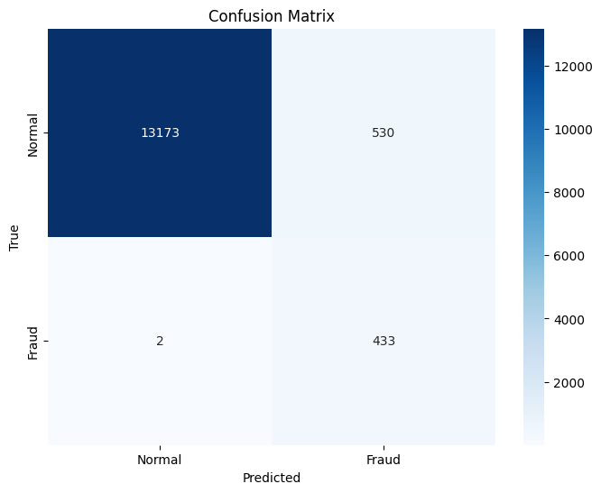
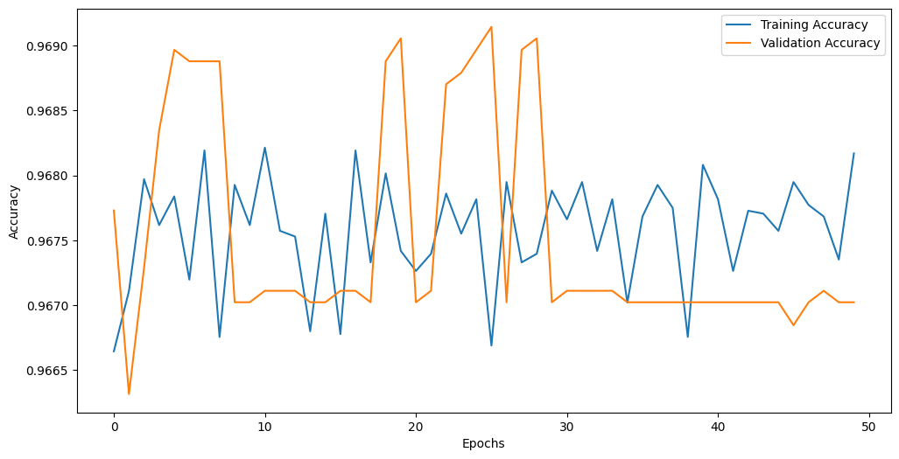

# 🏠 Deteksi Indikasi Penipuan pada Platform Airbnb menggunakan Neural Network
Proyek ini bertujuan untuk mendeteksi indikasi penipuan pada data listing properti di Airbnb dengan pendekatan berbasis _machine learning_. Sistem ini menggunakan data historis dan fitur-fitur numerik serta indikator perilaku mencurigakan untuk mengklasifikasikan apakah sebuah listing berindikasi penipuan atau tidak.

---

## 📌 Tujuan Proyek
- Membersihkan dan memproses dataset publik Airbnb.
- Mengidentifikasi ciri-ciri penipuan berdasarkan anomali harga, service fee, dan indikator perilaku pengguna.
- Membangun model klasifikasi menggunakan **Artificial Neural Network (ANN)**.
- Mengevaluasi performa model menggunakan metrik akurasi dan confusion matrix.

---

## 🧰 Teknologi & Tools
- Python (Google Colab)
- Pandas, NumPy
- Scikit-learn
- Matplotlib & Seaborn
- TensorFlow & Keras

---

## 📊 Dataset
Dataset yang digunakan adalah `Airbnb_Open_Data.csv` yang didapat dari _platform_ Kaggle, dengan beberapa pembersihan awal seperti:
- Menghapus kolom tidak relevan (`id`, `lat`, `long`, dll.)
- Menghapus data duplikat dan missing value pada kolom penting
- Mengonversi kolom harga dan service fee ke format numerik

---

## ⚙️ Feature Engineering
- **Fitur numerik & statistika**: `price`, `service fee`, `availability 365`, `reviews`, `review rate`
- **Fitur kategorikal**: `room type`, `neighbourhood group`
- **Fitur turunan untuk deteksi penipuan**, seperti:
  - Anomali harga dan service fee berdasarkan rata-rata per cluster
  - Properti aktif setahun penuh tapi review minim
  - Host belum terverifikasi

Semua indikator digabung untuk membentuk label target baru: `is_fraud`.

---

## 🧠 Arsitektur Model Neural Network
Model ANN terdiri dari:
- Dense(128, ReLU) + Dropout(0.3)
- Dense(64, ReLU) + Dropout(0.2)
- Dense(32, ReLU)
- Dense(1, Sigmoid)

Model dikompilasi dengan:
```python
loss = 'binary_crossentropy'
optimizer = 'adam'
metrics = ['accuracy']
```

---

## 📈 Hasil Training
- Epochs: 50  
- Akurasi pelatihan: ~96.7%  
- Akurasi validasi: ~96.9%  
- Akurasi pengujian akhir: **96.2%**  
- Loss pengujian akhir: **0.047**

---

## 🔍 Confusion Matrix
Visualisasi confusion matrix menunjukkan performa klasifikasi antara listing normal dan terindikasi fraud:


---

## 📉 Visualisasi Training
Grafik akurasi selama proses pelatihan:


---

## 🚀 Cara Menjalankan
1. Unggah file `Airbnb_Open_Data.csv` ke Google Colab.
2. Jalankan seluruh sel dalam notebook.
3. Model akan dilatih dan dievaluasi langsung di Colab.

---

## 📧 Kontak
Email: cindyzakya@gmail.com
